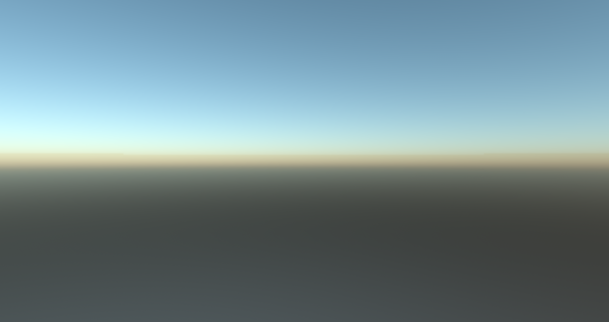
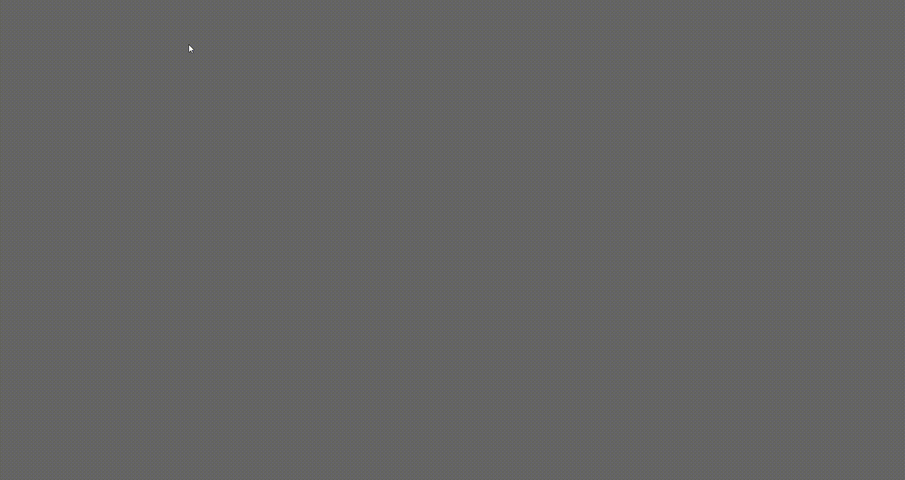
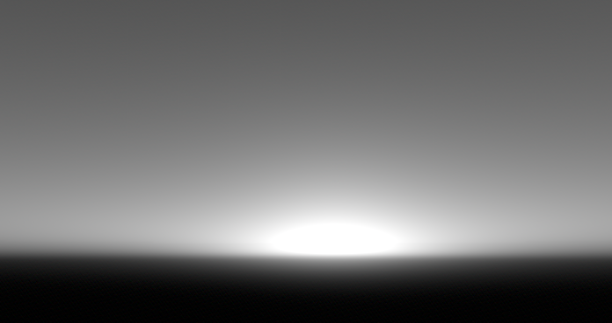

# examples

## [basic.rs](basic.rs)

The most simple usage of bevy_atmosphere. It uses the default `Atmosphere`, which has Earth-like parameters. Feel free to copy it as a template!

## [cycle.rs](cycle.rs)

A daylight cycle in the default `ATmosphere`, updating every 50ms.

## [detection.rs](detection.rs)

Demonstrates adding and removing the skybox with the `detection` feature. Use `LMouse` to add and `RMouse` to remove.

## [gradient.rs](gradient.rs)

Demonstrates using `Gradient` model. Use the number keys to switch presets. (Preset 3 shown here)

## [models.rs](models.rs)

Demonstrates using the different models available. Use the letter keys to switch models.

## [nishita.rs](nishita.rs)

Demonstrates using `Nishita` model. Use the number keys to switch presets. (Preset 2 shown here)

## [splitscreen.rs](splitscreen.rs)

A split-screen application, demonstrating the flexibility for local multiplayer games. Uses a custom `Atmosphere` to change the sky color.

## [settings.rs](settings.rs)

Demonstrates using `AtmosphereSettings` to update the resolution on the fly, similar to how an in-game quality settings menu could operate. Use the number keys to switch presets.
